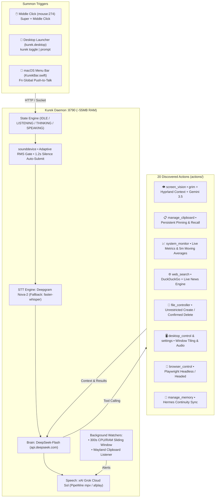

<p align="center">
  
</p>

<p align="center">
  <strong>Kurekizmo (Kurek)</strong>
</p>

<p align="center">
  <strong>Autonomous, sub-second personal AI assistant with native screen vision, xAI Grok voice, Wayland clipboard manager, and live web intelligence. Built for Arch Linux (Hyprland / Omarchy) and macOS. ~55MB RAM.</strong>
</p>

<p align="center">
  
  
  
  
  
  
</p>

---

Kurekizmo is an ultra-fast, local-first personal AI assistant engineered for high-performance developer workstations. It discards bloated 500MB+ Electron/web containers in favor of a lean ~55MB Python daemon, instant mouse scroll-wheel summoning, native monitor perception via Wayland `grim`, persistent clipboard pinning, real-time web research with auto-generated Markdown reports, and bidirectional memory continuity with Hermes.

---

## ⚡ Key Capabilities

- **👁️ Visual Perception Cortex:** Zero-latency monitor perception via `grim` (Wayland/Hyprland) and active window inspection (`hyprctl activewindow`) analyzed through Gemini 3.5 Flash. One-off diagnosis (*"What is causing this compiler error?"*) and continuous background observation (*"Watch my screen till I say so and critique my layout"*).
- **🎙️ Adaptive VAD & Voice Pipeline:** Ambient noise tracking auto-submits on 1.2s silence. Sub-second transcription via Deepgram Nova-2 (or local Whisper), direct reasoning via DeepSeek-Flash with full reasoning-token persistence, and natural conversational speech using xAI Grok Cloud TTS (**Sol** voice) streamed via PipeWire `mpv` (Linux) or `afplay` (macOS).
- **📋 Persistent Wayland Clipboard Manager:** Background daemon captures every system copy (`wl-paste`). Pin snippets with voice labels (*"Pin my clipboard as Database URL"*), recall pinned clips, or restore them back to the OS clipboard (*"Copy my Stripe key to clipboard"*) without touching the mouse.
- **📈 300-Second Sustained Resource Watcher:** Tracks a 5-minute sliding window of CPU and RAM usage. If average load exceeds 85% sustained over 300 seconds, Kurek identifies the top culprit process, dispatches a desktop notification (`notify-send`), and warns you verbally over the speaker.
- **🔬 Universal Autonomous Research & File Creation:** Deep search across multiple live sources, automated Markdown synthesis, and instant file creation on disk without asking permission. Strict safety confirmation gate required only for file deletion (*"Are you sure you want to delete [file]? Yes or No?"*).
- **🧠 Bidirectional Hermes Memory Continuity:** Automatically synchronizes knowledge and preferences with Hermes (`~/.hermes/profiles/eldio/memories/USER.md` and `MEMORY.md`).
- **🛠️ 20 Native System Tools:** Full file management, Playwright browser control, volume/brightness adjusters, Hyprland window tiling, alarms, and application launchers.

---

## 🏗️ Architecture



---

## ⌨️ Desktop Bindings & CLI

### Hyprland Bindings (`~/.config/hypr/bindings.lua`)
```lua
-- Middle click mouse scroll-wheel to toggle voice listening
o.bind("mouse:274", "Summon Kurek Middle Click", "/home/arch/.local/bin/kurek toggle", { mouse = true })
o.bind("SUPER + mouse:274", "Summon Kurek Super+Middle Click", "/home/arch/.local/bin/kurek toggle", { mouse = true })
```

### CLI Commands (`kurek`)
```bash
kurek toggle           # Toggle microphone listening
kurek status           # Check current daemon state
kurek prompt "..."     # Send text query directly without mic
kurek start            # Launch daemon in background
kurek stop             # Stop all daemon processes
```

---

## 🔧 Environment Configuration (`.env`)

```bash
DEEPSEEK_API_KEY=sk-...    # Direct platform key for api.deepseek.com
XAI_API_KEY=xai-...        # Direct platform key for api.x.ai (Grok TTS)
GEMINI_API_KEY=AIza...     # Google Gemini 3.5 Flash for screen vision
DEEPGRAM_API_KEY=...      # Deepgram Nova-2 STT (falls back to local Whisper)
```

---

## 🚀 Quickstart

### Arch Linux / Omarchy
```bash
git clone git@github.com:nodaysidle/kurekizmo.git
cd kurekizmo
./install_linux.sh
kurek start
```

### macOS Native Menu Bar
```bash
./launch_kurek.sh
swiftc -O -o menubar/KurekBar menubar/KurekBar.swift
./menubar/KurekBar &
```

---

## 📄 License

MIT © [Alan Pfeifer (NODAYSIDLE)](https://github.com/nodaysidle)
