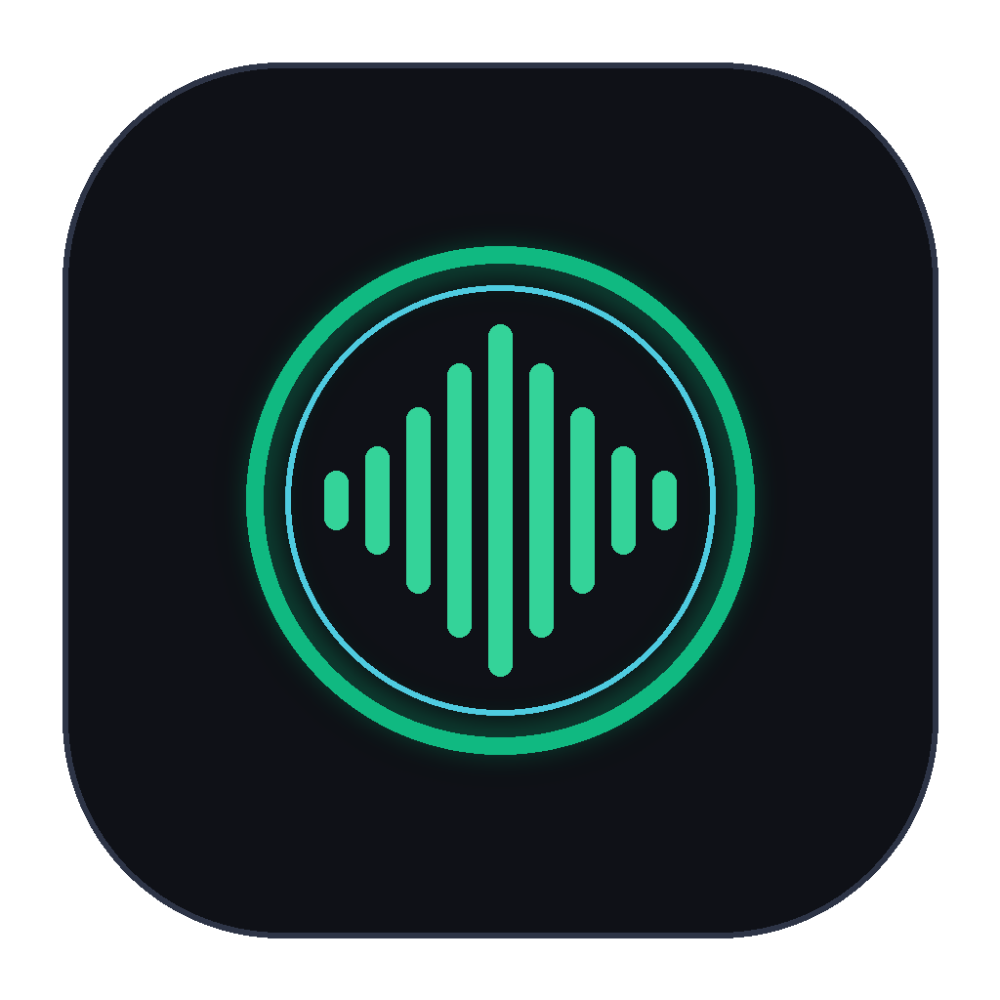
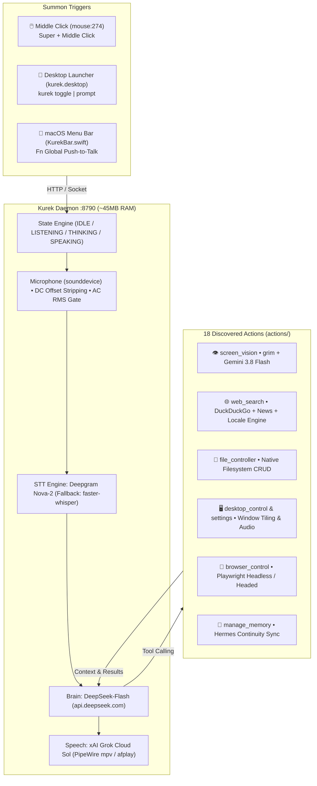

<p align="center">
  
</p>

<p align="center">
  <strong>Kurekizmo</strong>
</p>

<p align="center">
  <strong>Autonomous, headless personal AI assistant with native screen vision, xAI Grok voice, and live web intelligence. Built for Arch Linux (Hyprland) and macOS. ~45MB RAM.</strong>
</p>

<p align="center">
  
  
  
  
  
  
</p>

---

Kurekizmo is a sub-second, local-first personal AI assistant engineered for high-performance developer setups. It discards heavy 500MB+ Electron/Qt frameworks in favor of an ultra-lean 45MB Python daemon, instant mouse scroll-wheel summoning, native monitor perception via Wayland `grim`, real-time internet search, and bidirectional memory continuity with Hermes.

---

## ⚡ Highlights

- **Visual Perception Cortex:** Zero-latency monitor perception via `grim` (Wayland/Hyprland) or `screencapture` (macOS) analyzed through `gemini-3.8-flash`. Supports one-off inspection (*"What is this error?"*) and continuous background observation (*"Watch my screen till I say so and tell me what you think"*).
- **Voice & Reasoning:** Direct platform reasoning through DeepSeek-Flash (`api.deepseek.com`), sub-second transcription with Deepgram Nova-2 / Whisper, and natural conversational speech using xAI Grok Cloud TTS (**Sol** voice) streamed directly over PipeWire `mpv` (Linux) or `afplay` (macOS).
- **Live Internet Research:** Real-time web intelligence powered by DuckDuckGo (`ddgs`) with automatic locale context (Slovenia / CEST / UTC+2) for exact timetables (MotoGP, F1, live sports, tech releases).
- **Instant Mouse Summon:** Click your mouse scroll-wheel (`mouse:274`) or press `Super+Space` from any workspace. Auto-submits on 1.2s silence.
- **Three-Tier Persistent Memory:** In-flight rolling context, long-term structured storage, and live bidirectional sync with Hermes (`~/.hermes/profiles/eldio/memories/USER.md` & `MEMORY.md`).
- **18 Native System Tools:** Full file management, Playwright browser control, volume/brightness adjusters, Hyprland window tiling, alarms, and application launchers.

---

## 🏗️ Architecture



---

## 👁️ Visual Perception Cortex

Kurekizmo inspects your displays natively with zero RAM overhead:

### On-Demand Inspection
> *"Kurek, look at my screen. What is causing this compiler error?"*  
> *"What car wallpaper is on my desktop?"*  
> Takes a sub-15ms screenshot via `grim`, feeds it to Gemini 3.8 Flash, and delivers a concise spoken diagnosis.

### Continuous Screen Observation
> *"Kurek, watch the screen till I say so and tell me what you think about my UI layout."*  
> Launches a background watcher with structural frame-diffing. It monitors your canvas, detects visual shifts, evaluates them against your focus topic, and speaks candid critiques and warnings through Sol until you say *"stop watching"*.

---

## 🌐 Live Web Intelligence

Standard LLMs hallucinate outdated sports schedules and news. Kurekizmo queries live DuckDuckGo text/news endpoints and resolves your locale:

> **User:** *"When does today start the MOTOGP in my locale?"*  
> **Kurek:** *"The MotoGP race at the Japanese Grand Prix starts at 07:00 CEST on Sunday, October 4, which is 14:00 local track time at Motegi. The Sprint race gets underway today at 08:00 CEST."*

---

## ⌨️ Desktop Bindings & CLI

### Hyprland (`~/.config/hypr/bindings.lua` or `hyprland.conf`)
```ini
# Summon Kurek via scroll wheel or shortcut
bind = , mouse:274, exec, kurek toggle
bind = SUPER, mouse:274, exec, kurek toggle
bind = SUPER, K, exec, kurek toggle
```

### CLI Binary (`kurek`)
```bash
kurek toggle           # Toggle listening on / off
kurek prompt "..."     # Direct text query without mic
kurek status           # Check daemon health & state
kurek start            # Launch background daemon
kurek stop             # Stop daemon and audio streams
```

---

## 🛠️ Actions & Capabilities

| Action | File | Capabilities |
|---|---|---|
| `screen_vision` | `actions/screen_vision.py` | Native `grim` monitor capture, visual inspection, continuous watching |
| `web_search` | `actions/web_search.py` | DuckDuckGo search & news with locale-aware timetable synthesis |
| `file_controller` | `actions/file_controller.py` | Read, write, append, search, list, move files across the filesystem |
| `browser_control` | `actions/browser_control.py` | Playwright browser automation (navigation, clicks, forms, scraping) |
| `computer_settings` | `actions/computer_settings.py` | Audio volume, brightness, mute, network toggles |
| `desktop_control` | `actions/desktop.py` | Window minimization, maximization, tiling, workspace switching |
| `manage_memory` | `actions/memory_tool.py` | Structured recall & bidirectional sync with Hermes memory |
| `open_app` | `actions/open_app.py` | Launch native Linux binaries, GUI apps, and desktop tools |
| `reminder` | `actions/reminder.py` | Schedule desktop notifications and system alarms |

---

## 🚀 Quickstart

### 1. Prerequisites
- **Arch Linux / Omarchy Quattro (Hyprland)** or **macOS**
- Wayland tools: `sudo pacman -S grim mpv`
- Python 3.12+

### 2. Setup & Virtual Environment

```bash
git clone git@github.com:nodaysidle/kurekizmo.git /home/arch/dev/nodaysidle/kurekizmo
cd /home/arch/dev/nodaysidle/kurekizmo

uv venv
source .venv/bin/activate
uv pip install -r requirements.txt
uv pip install pillow ddgs google-genai
```

### 3. Configure Secrets (`.env`)

```bash
# Brain (api.deepseek.com)
DEEPSEEK_API_KEY=sk-...

# Voice Output (api.x.ai)
XAI_API_KEY=xai-...

# Visual Perception (aistudio.google.com - free tier)
GEMINI_API_KEY=AIzaSy...

# Optional: Deepgram Nova-2 (falls back to local faster-whisper)
DEEPGRAM_API_KEY=...
```

### 4. Install & Launch

```bash
./install_linux.sh
./launch_kurek.sh start
```

---

## 📊 Benchmark

| Metric | Traditional Assistant (Electron/Qt) | Kurekizmo Daemon |
|---|---|---|
| **RAM Usage** | ~450MB – 650MB | **~45MB** |
| **Summon Latency** | 1.8s – 3.2s | **< 200ms** |
| **Monitor Capture** | Slow window grab (~600ms) | **~15ms** (`grim`) |
| **Voice Output** | Robotic local TTS / Web Speech | **xAI Grok Sol** natural human voice |
| **Desktop Footprint** | Cluttered persistent window | **100% Headless** |

---

## 📜 License

Distributed under the **MIT License**. Engineered for [NODAYSIDLE](https://github.com/nodaysidle).
