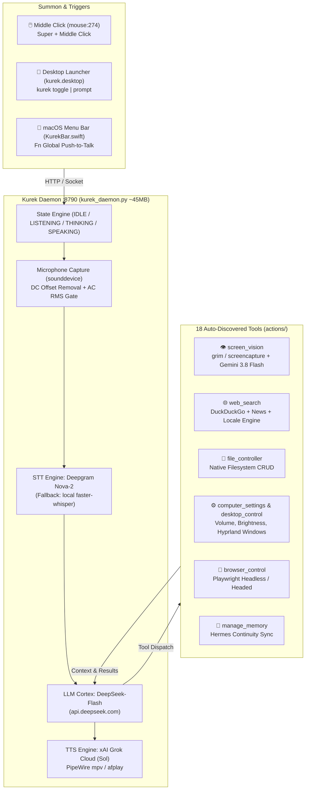

<div align="center">


# ⚡ KUREKIZMO
### Ultra-Fast, Headless Autonomous Personal AI Assistant
**DeepSeek-Flash Reasoning • xAI Grok Voice • Real-Time Screen Vision • Live Web Search • Hermes Memory**

[](https://archlinux.org/)
[](https://apple.com/macos)
[](https://python.org/)
[](https://api.deepseek.com)
[-1E1E1E?style=for-the-badge&logo=x&logoColor=white)](https://x.ai)
[](/)
[](LICENSE)

<br/>

> **Kurekizmo** is a lean, sub-second personal AI assistant built for high-performance developer workflows on **Arch Linux (Hyprland)** and **macOS**. It eliminates bloated 500MB Electron/Qt wrappers in favor of a 45MB headless daemon, instant mouse scroll-wheel summoning, native monitor perception, continuous screen observation, live internet research, and seamless memory continuity.

</div>

---

## ⚡ Highlights & Key Capabilities

| Capability | Technology | Description |
|---|---|---|
| 👁️ **Visual Perception Cortex** | `grim` (Wayland) / `screencapture` + Gemini 3.8 Flash | Native zero-latency screen capture. Inspects open code, errors, and designs on demand or continuously monitors your screen (*"watch the screen till I say so"*). |
| 🎙️ **Voice & Audio Pipeline** | Deepgram Nova-2 / Whisper + xAI Grok Cloud TTS | Sub-second STT with DC offset stripping and conversational natural speech using xAI's **Sol** (`sal`) voice streamed over PipeWire `mpv` (Linux) or `afplay` (macOS). |
| 🧠 **Autonomous Brain** | DeepSeek-Flash (`api.deepseek.com`) | Direct platform reasoning with native OpenAI-compatible tool calling. Uninhibited, witty, and loyal execution of system commands without corporate lecturing. |
| 🌐 **Real-Time Web Intelligence** | DuckDuckGo (`ddgs`) + News + Locale Synthesis | Automatically parses conversational queries, resolves user timezone (e.g. Slovenia / CEST), and synthesizes live timetables (MotoGP, F1, current news). |
| 🖱️ **Instant Mouse & Key Summon** | Hyprland `mouse:274` / macOS Fn Monitor | Click your mouse scroll wheel from any window or press `Super+Space` to talk instantly. Auto-submits on 1.2s silence. |
| 💾 **Three-Tier Memory Architecture** | Rolling History + Hermes Sync | Dynamic bidirectional synchronization with Hermes knowledge base (`~/.hermes/profiles/eldio/memories/USER.md` & `MEMORY.md`). |
| 🛠️ **18 Direct Computer Tools** | Native System Automation | File manager, browser automation (Playwright), volume/brightness controllers, window tiling, reminders, and application launchers. |

---

## 🏗️ System Architecture



---

## 👁️ Visual Cortex: See Your Monitor

Kurekizmo natively sees what you are working on without heavy local VLM overhead:

* **On-Demand Inspection:**
  > *"Kurek, look at my screen. What is causing this compiler error?"*  
  > *"What car wallpaper is on my desktop?"*  
  > Takes an instant snapshot via Wayland `grim` (<15ms), feeds it to Gemini 3.8 Flash, and speaks the solution through Sol.
* **Continuous Screen Observation:**
  > *"Kurek, watch the screen till I say so and tell me what you think about my UI."*  
  > Launches a low-overhead background watcher with structural frame-diffing. It monitors your canvas, detects visual changes, evaluates them with DeepSeek, and chimes in verbally with critiques and insights until you say *"stop watching"*.

---

## 🌐 Live Web Search: Real-Time & Locale-Aware

Unlike generic assistants that hallucinate outdated schedules, Kurekizmo extracts real-time internet data:

* **Zero-Hallucination Sports & Timetables:**
  > *"When does today start the MOTOGP in my locale?"*  
  > Automatically resolves your local timezone (**Slovenia / CEST / UTC+2**), queries DuckDuckGo text/news feeds, and delivers the exact session start times:
  > *"The Japanese Grand Prix Sprint race begins today at 08:00 AM CEST, with the main race tomorrow at 07:00 AM CEST."*
* **Live News & Tech Research:** Fetches the latest releases, documentation, and breaking headlines with automatic deduplication.

---

## ⌨️ Desktop Bindings & Controls

### Arch Linux / Omarchy Quattro (Hyprland)
Configured in `~/.config/hypr/bindings.lua` or `hyprland.conf`:

```ini
# Summon Kurek via mouse scroll wheel or keyboard shortcut
bind = , mouse:274, exec, kurek toggle
bind = SUPER, mouse:274, exec, kurek toggle
bind = SUPER, K, exec, kurek toggle
```

### Command-Line Interface (`kurek`)

```bash
kurek toggle           # Toggle listening on / off
kurek prompt "..."     # Send text query directly without microphone
kurek status           # Check daemon health & active state
kurek start            # Launch daemon in background
kurek stop             # Gracefully stop daemon and audio streams
```

---

## 🚀 Quickstart & Installation

### 1. Prerequisites
* **Arch Linux / Omarchy** (Hyprland / Wayland) or **macOS** (Sonoma / Sequoia)
* `grim` for native Wayland screenshot capture: `sudo pacman -S grim mpv`
* Python 3.12+ with `uv` or `venv`

### 2. Clone & Setup

```bash
git clone git@github.com:nodaysidle/kurekizmo.git /home/arch/dev/nodaysidle/kurekizmo
cd /home/arch/dev/nodaysidle/kurekizmo

# Create virtual environment & install dependencies
uv venv
source .venv/bin/activate
uv pip install -r requirements.txt
uv pip install pillow ddgs google-genai
```

### 3. Environment Secrets (`.env`)

Create `.env` in the project root:

```bash
# Brain & Reasoning
DEEPSEEK_API_KEY=sk-...

# Voice & Speech (Sol Voice)
XAI_API_KEY=xai-...

# Visual Perception (Free tier available at aistudio.google.com)
GEMINI_API_KEY=AIzaSy...

# Optional: Ultra-fast cloud STT (falls back to local faster-whisper if omitted)
DEEPGRAM_API_KEY=...
```

### 4. Install Desktop Integration & Launch

```bash
# Link binary to ~/.local/bin and install .desktop entry
./install_linux.sh

# Start the daemon
./launch_kurek.sh start
```

---

## 🧠 Memory Continuity System

Kurekizmo maintains a persistent **three-tier memory**:
1. **In-Flight Session Memory:** Automatically records conversational turns and injects the last 10 turns for seamless multi-turn reasoning (`memory/kurek_history.json`).
2. **Structured Long-Term Store:** Dedicated JSON storage for personal preferences, hardware configurations, and user details (`memory/long_term.json`).
3. **Hermes Sync:** Dynamically loads and synchronizes with `~/.hermes/profiles/eldio/memories/USER.md` and `MEMORY.md`. Stored facts from Kurek are instantly visible to Hermes and vice-versa.

---

## 📊 Performance Comparison

| Metric | Traditional Assistant (Electron/Qt) | Kurekizmo Daemon |
|---|---|---|
| **RAM Usage** | ~450MB – 650MB | **~45MB** |
| **Summon Latency** | 1.8s – 3.2s | **< 200ms** (Instant PipeWire stream) |
| **Screen Perception** | Slow window grab (~600ms) | **~15ms** native `grim` + Gemini Flash |
| **Voice Output** | Robotic local TTS / Web Speech | **xAI Grok Sol** natural human voice |
| **Desktop Footprint** | Cluttered persistent window | **100% Headless** + subtle desktop notification |

---

## 📜 License

Distributed under the **MIT License**. Built with obsessive speed and privacy for [NODAYSIDLE](https://github.com/nodaysidle).
